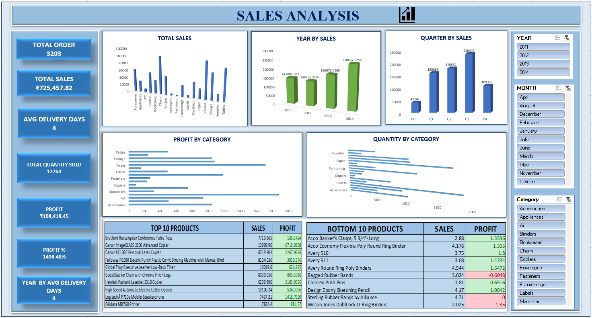
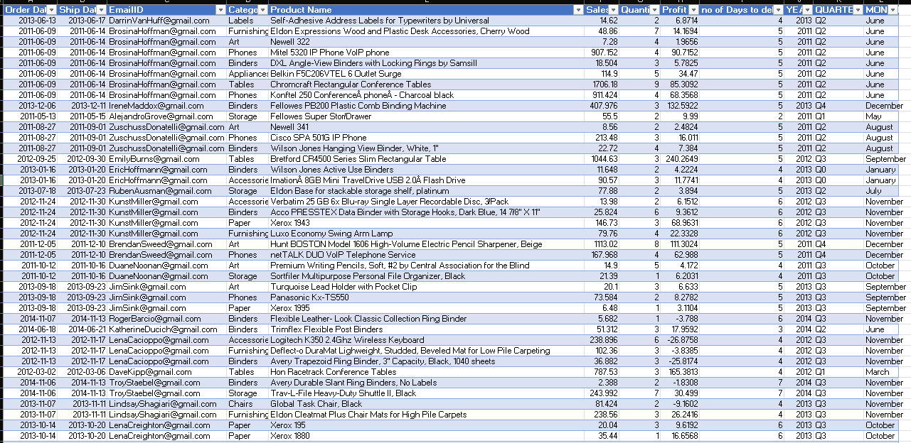

# Sales-Data-Analysis
Developed an interactive Sales &amp; Profit Dashboard to analyze sales, profit, quantity, product and category performance. The dashboard includes KPIs, sales trends, profit margin, delivery analysis, and interactive filters to support data-driven business decisions.

## Project Preview

## Project Overview

### What the project is
An interactive Sales & Profit Dashboard designed to analyze overall business performance.
### What data or topic it covers
It covers sales, profit, quantity, products, categories, order dates, and delivery days.
### What users can explore or learn from it
Users can explore sales and profit trends, profit margin, category performance, top and low-performing products, quantity sold, and delivery efficiency. Interactive filters help compare performance by year, quarter, category, and product.

## From Data to Dashboard
Yes. Since you **created the Date and Delivery Days fields**, you can describe the project process like this:

### From Data to Dashboard

* **Data Collection:** Used sales data containing orders, products, categories, sales, profit, and quantity.
* **Data Preparation:** Created **Date** fields from order information and calculated **Delivery Days** using Order Date and Ship Date.
* **Data Analysis:** Analyzed sales, profit, profit margin, quantity, product and category performance.
* **Dashboard Creation:** Built interactive KPI cards, charts, and filters to visualize business performance.
* **Insights:** Users can identify sales trends, profitable and loss-making products, category performance, and delivery efficiency.

### Source Data

## Dashboard Features
###KPI Cards:
  - Total Sales, Total Profit
  - Total Quantity
  - Total Orders
  - Average Delivery Days
  - and Profit Margin
###Sales & Profit Trends:
- Analyze performance by Year and Quarter.
###Category Analysis:
- Compare sales
- Profit
- Quantity across categories.
###Product Analysis:
- Identify top-selling and low-performing products.
###Profit Margin:
- Monitor profitability and compare performance.
- 
###Delivery Analysis:
- Analyze delivery days and delivery efficiency.
###Interactive Filters:
- Filter data by Year
- uarter
- Category
- Product
- Date.
###Interactive Visualizations:
- Use charts and graphs to explore business performance easily.
- 
## Files Included

| File | Description |
|---|---|
| `Sales-dashbord.xlsx` | Completed Excel dashboard |
| `Dashboard.png` | Preview of the final dashboard |
| `Data.png` | Preview of the source data |
| `README.md` | Project documentation |

## How to Download and Use

1. Download `Sales-dashboard.xlsx`.
2. Open the workbook using Microsoft Excel.
3. Navigate to the dashboard worksheet.
4. Use the available filters and slicers to explore the results.

[Download the Excel Dashboard](Sales-dashboard.xlsx)

## Tools and Skills
- Microsoft Excel
- Excel formulas
- PivotTables
- PivotCharts
- Slicers
- Data analysis
- Dashboard design
- Data visualization
